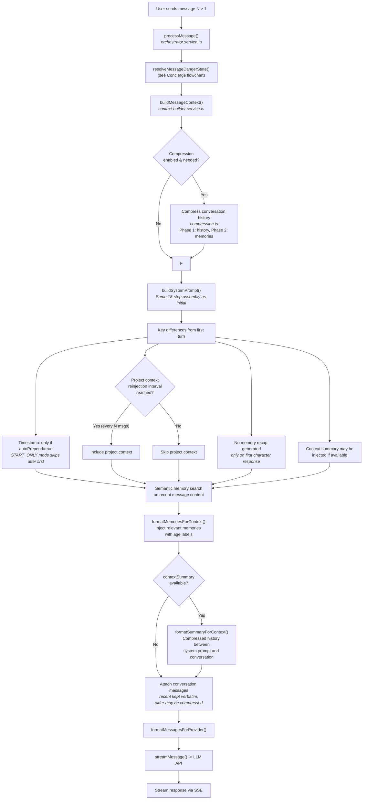
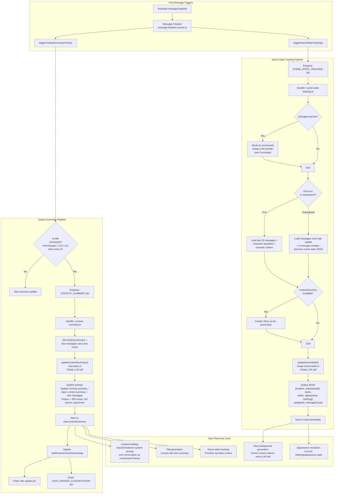
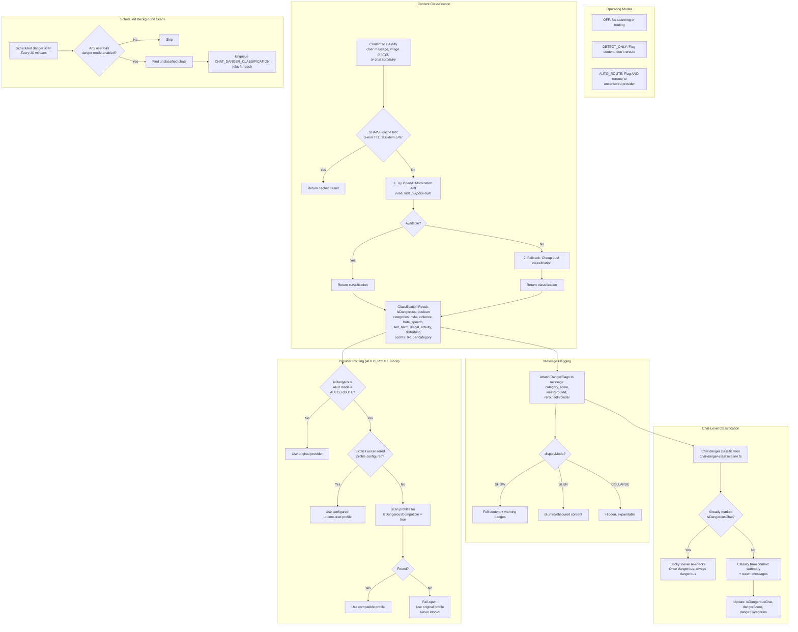
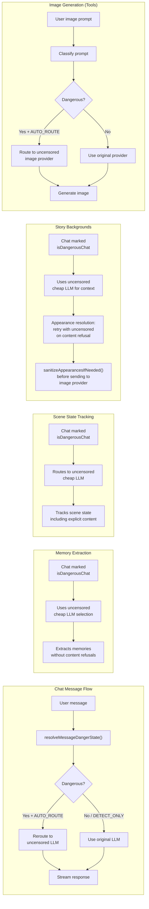

# System Flowcharts

Visual workflow diagrams for the core Quilltap systems: prompt building, memory extraction, scene tracking, story backgrounds, and the Concierge content routing layer.

These diagrams use [Mermaid](https://mermaid.js.org/) syntax and render in GitHub, VS Code (with extensions), and most modern documentation tools.

---

## Table of Contents

1. [Initial Chat System Prompt Assembly](#1-initial-chat-system-prompt-assembly)
2. [Subsequent Turn System Prompt Assembly](#2-subsequent-turn-system-prompt-assembly)
3. [Memory Extraction Pipeline](#3-memory-extraction-pipeline)
4. [Scene Tracking Summarizer](#4-scene-tracking-summarizer)
5. [Story Background Generator (The Lantern)](#5-story-background-generator-the-lantern)
6. [The Concierge: Content Routing Overview](#6-the-concierge-content-routing-overview)
7. [Unified Message Lifecycle](#7-unified-message-lifecycle)

---

## 1. Initial Chat System Prompt Assembly

How the system prompt is constructed for the **first message** in a chat with an LLM character.

Key files: `lib/chat/context/system-prompt-builder.ts`, `lib/chat/context-manager.ts`, `lib/services/chat-message/orchestrator.service.ts`, `lib/services/chat-message/context-builder.service.ts`

```mermaid
flowchart TD
    A[User sends first message] --> B[POST /api/v1/messages]
    B --> C["handleSendMessage()<br/><i>orchestrator.service.ts</i>"]
    C --> D["processMessage()<br/>Load chat metadata, resolve character"]

    D --> E{"Multi-character<br/>chat?"}
    E -->|Yes| F[Resolve all participants<br/>with statuses]
    E -->|No| G[Resolve single character]
    F --> H[Resolve user identity / persona]
    G --> H

    H --> I["resolveMessageDangerState()<br/><i>danger-orchestrator.service.ts</i><br/>(see Concierge flowchart)"]
    I --> J["buildMessageContext()<br/><i>context-builder.service.ts</i>"]

    J --> K[Resolve timezone<br/>chat -> user settings -> env -> system]
    K --> L["buildContext()<br/><i>context-manager.ts</i>"]

    L --> SP["buildSystemPrompt()<br/><i>system-prompt-builder.ts</i>"]

    SP --> SP1["1. Character Identity Preamble<br/><i>'You are {char}...'</i>"]
    SP1 --> SP2{"timestampConfig<br/>.autoPrepend?"}
    SP2 -->|Yes| SP2a[2. Inject timestamp]
    SP2 -->|No| SP3
    SP2a --> SP3{"roleplayTemplate<br/>exists?"}
    SP3 -->|Yes| SP3a[3. Roleplay template system prompt]
    SP3 -->|No| SP4
    SP3a --> SP4{"toolInstructions<br/>provided?"}
    SP4 -->|Yes| SP4a[4. Tool instructions]
    SP4 -->|No| SP5
    SP4a --> SP5[5. Project context<br/><i>always on first message</i>]
    SP5 --> SP6[6. Base system prompt<br/><i>selected or default from character</i>]
    SP6 --> SP7{"character<br/>.personality?"}
    SP7 -->|Yes| SP7a[7. Character Personality section]
    SP7 -->|No| SP8
    SP7a --> SP8{"aliases?"}
    SP8 -->|Yes| SP8a[8. Character aliases]
    SP8 -->|No| SP9
    SP8a --> SP9{"pronouns?"}
    SP9 -->|Yes| SP9a[9. Character pronouns]
    SP9 -->|No| SP10
    SP9a --> SP10{"physicalDescriptions?"}
    SP10 -->|Yes| SP10a[10. Physical descriptions]
    SP10 -->|No| SP11
    SP10a --> SP11{"clothingRecords?"}
    SP11 -->|Yes| SP11a[11. Clothing / outfits]
    SP11 -->|No| SP12
    SP11a --> SP12{"scenario<br/>available?"}
    SP12 -->|Yes| SP12a[12. Scenario / setting]
    SP12 -->|No| SP13
    SP12a --> SP13{"exampleDialogues?"}
    SP13 -->|Yes| SP13a[13. Example dialogues]
    SP13 -->|No| SP14
    SP13a --> SP14{"tools available?"}
    SP14 -->|Yes| SP14a[14. Tool reinforcement<br/><i>character-voiced</i>]
    SP14 -->|No| SP15
    SP14a --> SP15{"Multi-char?"}
    SP15 -->|No| SP15a[15. User persona info]
    SP15 -->|Yes| SP15b[15. Multi-character context<br/><i>all participants, statuses</i>]
    SP15a --> SP16
    SP15b --> SP16{"silent mode?"}
    SP16 -->|Yes| SP16a[16. Silent mode instructions]
    SP16 -->|No| SP17
    SP16a --> SP17{"status change<br/>notifications?"}
    SP17 -->|Yes| SP17a[17. Status change notifications]
    SP17 -->|No| SP18
    SP17a --> SP18["18. Identity reinforcement<br/><i>'Respond only as {char}...'</i>"]

    SP18 --> MEM[Inject memories]

    MEM --> MEM1["generateMemoryRecap()<br/><i>memory-recap.ts</i><br/>Tiered: high/medium/low importance"]
    MEM1 --> MEM2[Cheap LLM summarizes into<br/>'What You Remember' narrative]
    MEM2 --> MEM3["searchMemoriesSemantic()<br/>Cosine similarity + effective weight"]
    MEM3 --> MEM4["formatMemoriesForContext()<br/><i>memory-injector.ts</i><br/>With age labels"]

    MEM4 --> MULTI{"Multi-char<br/>memories?"}
    MULTI -->|Yes| MULTI1["formatInterCharacterMemoriesForContext()<br/>Grouped by character"]
    MULTI -->|No| FMT
    MULTI1 --> FMT

    FMT["formatMessagesForProvider()<br/>Provider-specific formatting"]
    FMT --> STREAM["streamMessage()<br/><i>streaming.service.ts</i><br/>Call LLM API"]
    STREAM --> RESP[Stream response to client via SSE]
```



---

## 2. Subsequent Turn System Prompt Assembly

How the system prompt differs on **turns after the first**.



---

## 3. Memory Extraction Pipeline

From chat messages landing in the database through extraction, gating, reinforcement, and storage.

Key files: `lib/services/chat-message/memory-trigger.service.ts`, `lib/memory/memory-processor.ts`, `lib/memory/cheap-llm-tasks/memory-tasks.ts`, `lib/memory/memory-gate.ts`, `lib/memory/memory-weighting.ts`

```mermaid
flowchart TD
    subgraph Trigger["Message Trigger"]
        A[Assistant message saved to DB] --> B["triggerMemoryExtraction()<br/><i>memory-trigger.service.ts</i><br/>Fire-and-forget async"]
    end

    subgraph Queue["Two Processing Paths"]
        B --> C{"Source?"}
        C -->|Real-time chat| D["processMessageForMemoryAsync()<br/><i>memory-processor.ts</i><br/>Direct async, no queue"]
        C -->|Import / batch| E["enqueueMemoryExtraction()<br/><i>queue-service.ts</i><br/>MEMORY_EXTRACTION job"]
        E --> F["Job Processor<br/><i>processor.ts</i><br/>Poll every 2s, 3min timeout"]
        F --> G["Memory extraction handler<br/><i>handlers/memory-extraction.ts</i>"]
        G --> D2["processMessageForMemory()"]
        D --> D2
    end

    subgraph Extract["Parallel LLM Extraction"]
        D2 --> EX1["extractMemoryFromMessage()<br/><i>User memories</i><br/>'What did the USER reveal?'"]
        D2 --> EX2["extractCharacterMemoryFromMessage()<br/><i>Character memories</i><br/>'What did the CHARACTER reveal?'"]
        D2 --> EX3{"Multi-char<br/>chat?"}
        EX3 -->|Yes| EX4["extractInterCharacterMemoryFromMessage()<br/><i>What did observer learn about subject?</i>"]
        EX3 -->|No| PARSE

        EX1 --> PARSE[Parse JSON response<br/>Filter to significant: true only]
        EX2 --> PARSE
        EX4 --> PARSE
    end

    subgraph Gate["Memory Gate Decision"]
        PARSE --> CAND["For each MemoryCandidate:<br/>content, summary, keywords, importance"]
        CAND --> EMB["Generate embedding<br/><i>embedding-service.ts</i>"]
        EMB --> SIM["Search top 5 similar memories<br/><i>vector-store.ts</i><br/>Cosine similarity"]
        SIM --> THRESH{"Similarity<br/>score?"}

        THRESH -->|">= 0.80"| REINFORCE
        THRESH -->|"0.70 - 0.80"| RELATED
        THRESH -->|"< 0.70"| INSERT
    end

    subgraph Actions["Gate Actions"]
        REINFORCE["REINFORCE<br/><i>memory-gate.ts</i>"]
        REINFORCE --> R1[Increment reinforcementCount]
        R1 --> R2[Update lastReinforcedAt]
        R2 --> R3["extractNovelDetails()<br/><i>Regex-based, no LLM</i><br/>Proper nouns, dates, numbers,<br/>currency, technical terms"]
        R3 --> R4{"Novel details<br/>found?"}
        R4 -->|Yes| R5["Append as footnotes<br/>[+] new detail"]
        R4 -->|No| R6[Keep existing content]
        R5 --> R7["Recalc reinforcedImportance<br/>min(1.0, base + log2(count+1) * 0.05)"]
        R6 --> R7
        R7 --> R8[Re-embed if content changed]
        R8 --> DONE

        RELATED["INSERT_RELATED"]
        RELATED --> REL1[Create new memory]
        REL1 --> REL2[Bidirectional link with<br/>similar memories via relatedMemoryIds]
        REL2 --> DONE

        INSERT["INSERT"]
        INSERT --> INS1[Create new memory record]
        INS1 --> INS2[Store embedding in vector store]
        INS2 --> DONE
    end

    subgraph Weight["Time-Decay Weighting (at retrieval)"]
        DONE[Memory stored] --> W1["Memory retrieval request"]
        W1 --> W2["daysOld = now - max(createdAt, lastReinforcedAt)"]
        W2 --> W3["timeDecay = 0.5 ^ (daysOld / 30)<br/><i>Half-life: 30 days</i>"]
        W3 --> W4["rawWeight = reinforcedImportance * timeDecay"]
        W4 --> W5["minWeight = reinforcedImportance * 0.70<br/><i>Floor: 70% of importance retained</i>"]
        W5 --> W6["effectiveWeight = max(rawWeight, minWeight)"]
        W6 --> W7{"effectiveWeight<br/>> 0.05?"}
        W7 -->|Yes| W8[Include in search results]
        W7 -->|No| W9[Filter out]
    end

    subgraph Result["Return to Caller"]
        W8 --> RES["MemoryProcessingResult<br/>memoryIds[], reinforcedMemoryIds[],<br/>relatedMemoryIds[], tokenUsage, debugLogs"]
        RES --> STORE["Debug logs stored on<br/>source message in DB"]
    end
```



---

## 4. Scene Tracking Summarizer

Two related subsystems: the **context summary** (running narrative) and the **scene state tracker** (structured snapshot of the current scene).

Key files: `lib/chat/context-summary.ts`, `lib/background-jobs/handlers/context-summary.ts`, `lib/background-jobs/handlers/scene-state-tracking.ts`, `lib/memory/cheap-llm-tasks/image-scene-tasks.ts`



---

## 5. Story Background Generator (The Lantern)

Key files: `lib/background-jobs/handlers/story-background.ts`, `lib/background-jobs/handlers/title-update.ts`, `lib/memory/cheap-llm-tasks/image-scene-tasks.ts`, `lib/image-gen/appearance-resolution.ts`

```mermaid
flowchart TD
    subgraph Triggers["Trigger Points"]
        T1["Title auto-update completes<br/><i>title-update.ts</i>"] --> T1a["queueStoryBackgroundIfEnabled()"]
        T2["Manual: POST /api/v1/chats/[id]<br/>?action=regenerate-background"] --> T2a["handleRegenerateBackground()"]
    end

    subgraph Check["Pre-Checks"]
        T1a --> CHK
        T2a --> CHK
        CHK{"Story backgrounds<br/>enabled?"}
        CHK -->|No| STOP[No-op]
        CHK -->|Yes| CHK2{"Image profile<br/>available with<br/>valid API key?"}
        CHK2 -->|No| STOP
        CHK2 -->|Yes| ENQ["enqueueStoryBackgroundGeneration()<br/><i>queue-service.ts</i><br/>Deduplicates: reuses pending job"]
    end

    subgraph JobProc["Background Job Processing"]
        ENQ --> PROC["Job Processor claims job<br/><i>processor.ts</i>"]
        PROC --> HANDLER["handleStoryBackgroundGeneration()<br/><i>story-background.ts</i>"]
    end

    subgraph Context["Context Gathering"]
        HANDLER --> LOAD[Load chat, characters,<br/>image profile, chat settings]
        LOAD --> DANGER{"isDangerousChat?"}
        DANGER -->|Yes| DANGER1["Use uncensored cheap LLM<br/>(see Concierge)"]
        DANGER -->|No| SCENE
        DANGER1 --> SCENE

        SCENE --> SCENE1{"Fresh scene state?<br/><i>within 5 messages</i>"}
        SCENE1 -->|Yes| SCENE2[Use scene state directly<br/><i>Skip LLM call</i>]
        SCENE1 -->|No| SCENE3["deriveSceneContext()<br/><i>image-scene-tasks.ts</i><br/>Cheap LLM: analyze last 20 msgs<br/>-> 1-3 sentence atmospheric desc"]
    end

    subgraph Appearance["Character Appearance Resolution"]
        SCENE2 --> APP
        SCENE3 --> APP

        APP["resolveCharacterAppearances()<br/><i>appearance-resolution.ts</i>"]
        APP --> APP1{"Scene state has<br/>appearance data?"}
        APP1 -->|Yes| APP2[Use scene state appearance<br/><i>Skip LLM call</i>]
        APP1 -->|No| APP3["resolveAppearance()<br/>Cheap LLM task"]

        APP3 --> APP4{"Content refusal?"}
        APP4 -->|Yes| APP5[Retry with uncensored provider]
        APP4 -->|No| APP6
        APP5 --> APP6

        APP2 --> SAN
        APP6 --> SAN
        SAN{"Needs sanitization<br/>for image provider?"}
        SAN -->|Yes| SAN1["sanitizeAppearancesIfNeeded()<br/><i>Make safe for image API</i>"]
        SAN -->|No| CRAFT
        SAN1 --> CRAFT
    end

    subgraph Generate["Image Generation"]
        CRAFT["craftStoryBackgroundPrompt()<br/><i>image-scene-tasks.ts</i><br/>Cheap LLM: scene + characters<br/>-> atmospheric landscape prompt"]
        CRAFT --> PROV["Create image provider instance"]
        PROV --> GEN["provider.generateImage()<br/>1792x1024, quality=hd, style=natural"]
        GEN --> SAVE
    end

    subgraph Store["Storage & Display"]
        SAVE[Upload to file storage<br/>in /story-backgrounds/ folder]
        SAVE --> META[Create file metadata record<br/>SHA256 hash, dimensions, MIME type,<br/>generation prompt, linked to chat + characters]
        META --> UPD1["Update chat:<br/>storyBackgroundImageId,<br/>lastBackgroundGeneratedAt"]
        UPD1 --> UPD2{"Project with<br/>latest_chat mode?"}
        UPD2 -->|Yes| UPD3[Update project reference]
        UPD2 -->|No| DONE[Complete]
        UPD3 --> DONE
    end

    subgraph Display["Display Modes (Project Level)"]
        DONE --> DM{"backgroundDisplayMode"}
        DM -->|theme| DM1[No background, theme colors]
        DM -->|static| DM2[User-uploaded image]
        DM -->|project| DM3[Project's AI-generated image]
        DM -->|latest_chat| DM4[Most recent chat's<br/>AI-generated image]
    end
```



---

## 6. The Concierge: Content Routing Overview

How the Concierge intercepts, classifies, and optionally reroutes content across all subsystems.

Key files: `lib/services/chat-message/danger-orchestrator.service.ts`, `lib/services/dangerous-content/gatekeeper.service.ts`, `lib/services/dangerous-content/provider-routing.service.ts`



### Concierge Integration Points Across Systems



---

## 7. Unified Message Lifecycle

End-to-end view of what happens when a user sends a message, showing how all systems interconnect.

```mermaid
flowchart TD
    USER[User sends message] --> API["POST /api/v1/messages"]
    API --> ORCH["handleSendMessage()<br/><i>orchestrator.service.ts</i>"]

    ORCH --> LOAD[Load chat, character(s),<br/>connection profile, settings]

    LOAD --> CONCIERGE["THE CONCIERGE<br/>resolveMessageDangerState()"]

    CONCIERGE --> CONCIERGE1{"Danger mode<br/>enabled?"}
    CONCIERGE1 -->|OFF| BUILD
    CONCIERGE1 -->|"DETECT_ONLY /<br/>AUTO_ROUTE"| CONCIERGE2[Classify content]
    CONCIERGE2 --> CONCIERGE3{"Dangerous +<br/>AUTO_ROUTE?"}
    CONCIERGE3 -->|Yes| CONCIERGE4["Switch to uncensored<br/>provider + API key"]
    CONCIERGE3 -->|No| BUILD
    CONCIERGE4 --> BUILD

    BUILD["BUILD SYSTEM PROMPT<br/><i>system-prompt-builder.ts</i><br/>18-component assembly"]
    BUILD --> MEMORIES["INJECT MEMORIES<br/>Semantic search + weight ranking<br/>+ memory recap (if first msg)"]
    MEMORIES --> SUMMARY{"Context summary<br/>available?"}
    SUMMARY -->|Yes| SUM1[Inject compressed history]
    SUMMARY -->|No| CONV
    SUM1 --> CONV
    CONV[Attach conversation messages]
    CONV --> FORMAT["Format for provider"]
    FORMAT --> STREAM["STREAM TO LLM<br/><i>streaming.service.ts</i>"]

    STREAM --> RESPONSE[Receive streamed response]
    RESPONSE --> SAVE[Save user + assistant<br/>messages to database]

    SAVE --> FINAL["MESSAGE FINALIZER<br/><i>message-finalizer.service.ts</i>"]

    FINAL --> POST1["MEMORY EXTRACTION<br/><i>Async fire-and-forget</i>"]
    FINAL --> POST2["CONTEXT SUMMARY CHECK<br/><i>At title checkpoints</i>"]
    FINAL --> POST3["SCENE STATE TRACKING<br/><i>Background job</i>"]
    FINAL --> POST4["DANGER CLASSIFICATION<br/><i>Chat-level, if enabled</i>"]

    POST1 --> MEM_PIPE["Extract user + character memories<br/>Gate: reinforce / relate / insert<br/>Store with embeddings"]

    POST2 --> SUM_PIPE["Update running summary<br/>-> Chain: title update<br/>-> Chain: danger recheck"]

    SUM_PIPE --> TITLE{"Title updated?"}
    TITLE -->|Yes| LANTERN

    POST3 --> SCENE_PIPE["Update scene state JSON<br/>(location, characters,<br/>actions, appearance, clothing)"]

    LANTERN["THE LANTERN<br/><i>Story Background Generator</i>"]
    LANTERN --> LANTERN1["Gather scene context<br/>(from scene state or LLM)"]
    LANTERN1 --> LANTERN2["Resolve character appearances<br/>(from scene state or LLM)"]
    LANTERN2 --> LANTERN3["Craft image prompt<br/>(cheap LLM)"]
    LANTERN3 --> LANTERN4["Generate image<br/>1792x1024 landscape"]
    LANTERN4 --> LANTERN5["Save + update chat/project<br/>background references"]

    POST4 --> DANGER_PIPE["Classify chat from summary<br/>Sticky: once dangerous,<br/>always dangerous"]

    style CONCIERGE fill:#f9d71c,stroke:#333,color:#333
    style BUILD fill:#4a9eff,stroke:#333,color:#fff
    style MEM_PIPE fill:#50c878,stroke:#333,color:#fff
    style SUM_PIPE fill:#da70d6,stroke:#333,color:#fff
    style SCENE_PIPE fill:#ff7f50,stroke:#333,color:#fff
    style LANTERN fill:#87ceeb,stroke:#333,color:#333
    style DANGER_PIPE fill:#f9d71c,stroke:#333,color:#333
```

---

## File Reference Index

| System | Key Files |
|--------|-----------|
| **System Prompt** | `lib/chat/context/system-prompt-builder.ts`, `lib/chat/context-manager.ts`, `lib/services/chat-message/context-builder.service.ts`, `lib/services/chat-message/orchestrator.service.ts` |
| **Memory Extraction** | `lib/services/chat-message/memory-trigger.service.ts`, `lib/memory/memory-processor.ts`, `lib/memory/cheap-llm-tasks/memory-tasks.ts`, `lib/memory/memory-gate.ts`, `lib/memory/memory-weighting.ts` |
| **Memory Storage** | `lib/memory/memory-service.ts`, `lib/embedding/embedding-service.ts`, `lib/embedding/vector-store.ts`, `lib/database/repositories/memories.repository.ts` |
| **Context Summary** | `lib/chat/context-summary.ts`, `lib/background-jobs/handlers/context-summary.ts`, `lib/memory/cheap-llm-tasks/chat-tasks.ts` |
| **Scene State** | `lib/background-jobs/handlers/scene-state-tracking.ts`, `lib/memory/cheap-llm-tasks/image-scene-tasks.ts` |
| **Story Backgrounds** | `lib/background-jobs/handlers/story-background.ts`, `lib/background-jobs/handlers/title-update.ts`, `lib/image-gen/appearance-resolution.ts` |
| **The Concierge** | `lib/services/chat-message/danger-orchestrator.service.ts`, `lib/services/dangerous-content/gatekeeper.service.ts`, `lib/services/dangerous-content/provider-routing.service.ts`, `lib/background-jobs/handlers/chat-danger-classification.ts`, `lib/background-jobs/scheduled-danger-scan.ts` |
| **Background Jobs** | `lib/background-jobs/queue-service.ts`, `lib/background-jobs/processor.ts`, `lib/background-jobs/handlers/index.ts` |
| **Streaming** | `lib/services/chat-message/streaming.service.ts` |
| **Templates** | `lib/templates/processor.ts` |
